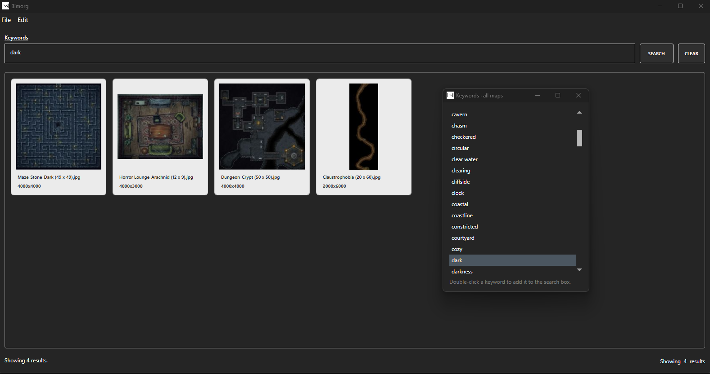

## Introduction

bimorg is an application which uses local AI to classify images, intended to be used to make management of D&D battlemaps easier.



## Download

Compiled downloads are not available.

## Compiling

To clone and run this application, you'll need [Git](https://git-scm.com) and [.NET](https://dotnet.microsoft.com/) installed on your computer. From your command line:

```
# Clone this repository
$ git clone https://github.com/btigi/bimorg

# Go into the repository
$ cd src

# Build  the app
$ dotnet build
```

## Prerequisites

- Install [ollama](https://ollama.com/)
- Install a vision capable model

## Usage

Scanning images is handed by the bimorg-scan console application which supports three commands.

- `bimorg scan --directory C:\maps`

- `bimorg remove-directory --directory C:\maps`

- `bimorg remove-file --path C:\maps\unused.png`

 Once scanning is complete the GUI app bimorg.exe can be used to interactively search scanned images by keyword.


## Licencing

bimorg is licenced under the MIT licence - full licence details are available in licence.md